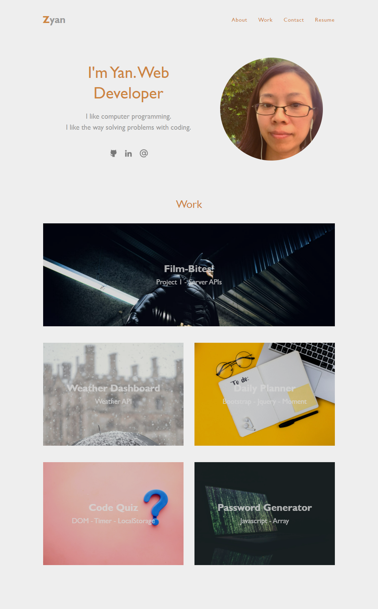
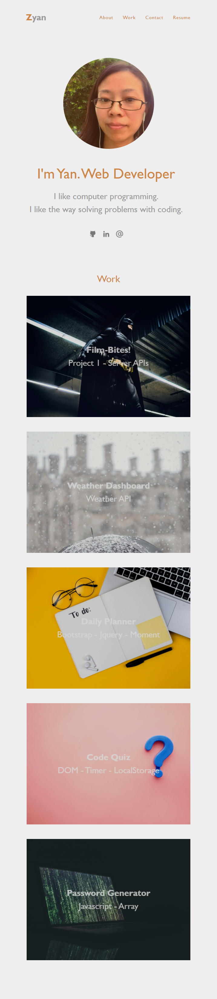

# Portfolio
## Description
This is my portfolio webpage. It has four parts about me. The first part is "about me". The second one is "work". The third one is "contact me". The last one is my resume.
## Links

<a href="https://yanbud.github.io/portfolio/">Link to the deployed website</a>

<a href="https://github.com/Yanbud/portfolio">Link to the code repository</a>

## Screenshot

 At size 992px and above, the webpage looks like the following image:

 At size 768px and above, the webpage looks like the following image:

 On mobile devices, anything under 768px, the webpage looks like the following image:

